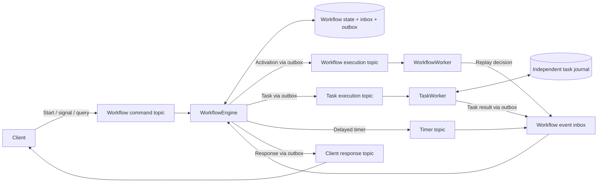

# Duraflow

**Message-driven durable workflows for Python, PostgreSQL, and Apache Pulsar.**

[](https://github.com/hynlab/duraflow/actions/workflows/ci.yml)
[](https://www.python.org/downloads/)
[](LICENSE)

Write orchestration as Python `async` functions. Duraflow records progress,
executes work through message-driven workers, and resumes from committed history
after restarts. Use it for multi-service jobs, human approvals, event-driven joins,
and long-running business processes.

## Features

- **Durable Python workflows:** typed task calls, parallel joins, races, children,
  recorded time/UUID values, and execution rollover.
- **A complete message loop:** workflow starts, replay requests, task results,
  signals, and completion responses travel through Pulsar.
- **Typed signal channels:** non-blocking receive registration, repeated receives,
  bounded streams, payload filters, and tag-targeted delivery.
- **Separate scalable roles:** workflow engines, workflow workers, task workers,
  workflow tag engines, and task tag engines.
- **Failure recovery:** atomic inbox/state/outbox commits, fenced task execution,
  stable idempotency keys, delayed retries, and broker-driven timers.
- **Python-friendly development:** infrastructure-free tests and runnable examples
  that use the same message handlers as the distributed runtime.
- **Operational tools:** CLI inspection and controls, readiness probes, structured
  logs, Prometheus metrics, and explicit history retention.

Duraflow is **alpha**. These guides describe the current source checkout, which
uses execution protocol 2. See the [upgrade section](guide/6_operations.md#upgrading-from-protocol-1)
when working with earlier alpha executions.

## Installation

Requires **Python 3.12+**.

```bash
git clone https://github.com/hynlab/duraflow.git
cd duraflow
python -m venv .venv
source .venv/bin/activate
python -m pip install -e .
```

For distributed services:

```bash
python -m pip install -e '.[postgres,pulsar]'
```

## Quick start

This example runs a complete message-driven workflow locally:

```python
import asyncio

from duraflow import Registry, TaskRef, WorkflowContext, task, workflow
from duraflow.testing import TestEnvironment

DOUBLE = TaskRef("double", int, int)


@task(ref=DOUBLE)
def double(value: int) -> int:
    return value * 2


@workflow(name="example", build_id="example-v1")
async def example(ctx: WorkflowContext, value: int) -> int:
    first, second = await ctx.gather(
        ctx.call(DOUBLE, value),
        ctx.call(DOUBLE, value + 1),
    )
    return first + second


async def main() -> None:
    async with TestEnvironment(Registry(example, double)) as env:
        handle = await env.client.start(example, 5, request_id="demo-1")
        print(await env.run(handle))  # 22


if __name__ == "__main__":
    asyncio.run(main())
```

Workflow functions describe orchestration. Tasks perform API calls, database
writes, and other business effects. `ctx.call()` schedules a durable task;
calling the decorated function directly remains an ordinary Python call.

Run the included examples:

```bash
python examples/quickstart.py       # 22
python examples/broadcast_join.py  # publication receipt and payload 27
python -m examples.signals         # approval through a channel; result 14
```

## Signal channels

Register reception before sending a request that may generate an immediate reply:

```python
from duraflow import ChannelRef

APPROVAL = ChannelRef("approval", bool)

# Inside a workflow:
approvals = ctx.channel(APPROVAL).receive(max_signals=1)
await ctx.call(SEND_APPROVAL_REQUEST, order)
approved = await approvals.next(timeout=3600)

# From a client holding this workflow's handle:
await handle.signal(APPROVAL, True, signal_id="approval-42")
```

`receive()` registers a durable stream without suspending the workflow. `next()`
waits for a value. Matching signals received after registration are buffered even
before `next()`; signals before registration are discarded. See the
[signal guide](guide/3_signals.md) for filters, tags, and replay semantics.

## Internal architecture

Duraflow follows Infinitic's message-driven component boundaries with an
independently authored Python API and JSON protocol.



**The loop:** start → replay → task → result → replay → next step → completion.
Signals and timers enter the same workflow state transition path. Normal
execution advances by consuming messages; workflow records are not scanned for
progress.

| Component | Responsibility |
| --- | --- |
| `Client` | Publish commands and consume responses; no workflow DB connection |
| `WorkflowEngine` | Own workflow state, accept events, resolve waits, and commit outgoing intent |
| `WorkflowWorker` | Replay immutable snapshots using the pinned implementation |
| `TaskWorker` | Execute business functions and publish results using its own execution journal |
| `TagEngine` / `TaskTagEngine` | Maintain separate indexes and perform resumable tag fan-out |
| `OutboxRelay` | Publish committed messages and recover interrupted sends |

Completed task results are injected during replay. External effects can run again
after an effect-before-result crash; use `TaskContext.idempotency_key` to make
those effects idempotent. The [architecture guide](guide/8_architecture.md)
details topic routing, transactional boundaries, ordering, and recovery.

## Guides

| # | Guide | Contents |
| --- | --- | --- |
| 0 | [Guide index](guide/0_index.md) | Reading order and terminology |
| 1 | [Getting started](guide/1_getting_started.md) | Installation and local examples |
| 2 | [Writing workflows](guide/2_workflows.md) | Calls, futures, retries, children, and replay |
| 3 | [Signals and channels](guide/3_signals.md) | Registration, filtering, repetition, and tag delivery |
| 4 | [Broadcast and join](guide/4_broadcast_and_join.md) | Multi-handler event processing |
| 5 | [Distributed services](guide/5_distributed.md) | Independent runtime processes and broker-only clients |
| 6 | [Operations](guide/6_operations.md) | Configuration, monitoring, controls, and protocol cutover |
| 7 | [Testing and contributing](guide/7_testing.md) | Unit, native, crash-recovery, and package checks |
| 8 | [Internal architecture](guide/8_architecture.md) | Components, topics, execution flow, and failure semantics |

## Contributing

Bug reports, documentation improvements, and pull requests are welcome.
Include a reproducible case when [reporting an issue](https://github.com/hynlab/duraflow/issues).

```bash
python -m pip install -e '.[dev,postgres,pulsar]'
make check
```

See the [testing guide](guide/7_testing.md) for native integration and recovery checks.

## License

Duraflow is licensed under the [Apache License 2.0](LICENSE).
See [PROVENANCE.md](PROVENANCE.md) for implementation provenance.
